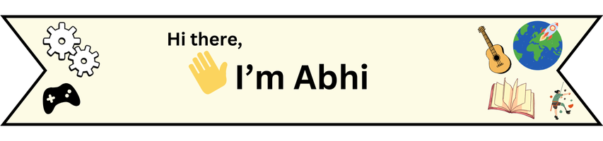

  
  
  (Copy: abhiparth@hotmail.co.uk)

## About Me:

### ☀️ By day, I’m:
- a coder, wrangling JavaScript into submission 💻
- a climbing instructor, teaching people to conquer new heights 🧗
- a guitarist, strumming away my stress 🎸
- a <a href="https://schoolofcode.co.uk/">School of Code</a> bootcamper, expanding my skills daily 🎓
- a brother, a son, and a friend 👨‍👩‍👧‍👦
- a sports player (but *not* a watcher!) 🎾
- a gamer with questionable skills but high spirits 🎮

### 🌃 And by night?
&nbsp;&nbsp;&nbsp;&nbsp;Well, I'm...
 
 
&nbsp;&nbsp;&nbsp;&nbsp;uh...
 
 
&nbsp;&nbsp;&nbsp;&nbsp;*…a dreamer, maybe?* 🤔

## Skills - current and past:

|   **Field**         | **Tech Stack**                                                                                                                   
|---------------------|--------------------------------------------------------------|
|   **Core**          |  	 |
|    **Backend**      |     |
|    **Frontend**     |  	  |
|    **Design**       |   |
|    **DevSecOps**    |    |
|    **Testing**      |   |

### Communication & Collaboration tools
  
### Other tools
  

<!--
**ab-stha/ab-stha** is a ✨ _special_ ✨ repository because its `README.md` (this file) appears on your GitHub profile.

Here are some ideas to get you started:

- 🔭 I’m currently working on ...
- 🌱 I’m currently learning ...
- 👯 I’m looking to collaborate on ...
- 🤔 I’m looking for help with ...
- 💬 Ask me about ...
- 📫 How to reach me: ...
- 😄 Pronouns: ...
- ⚡ Fun fact: ...
-->
